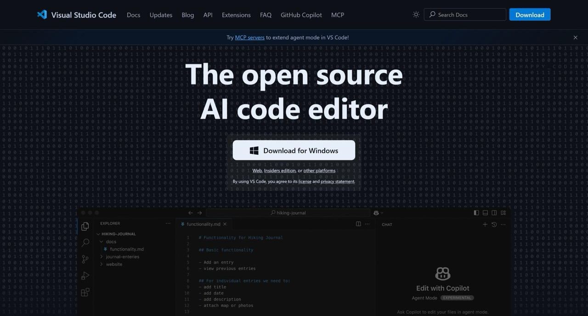
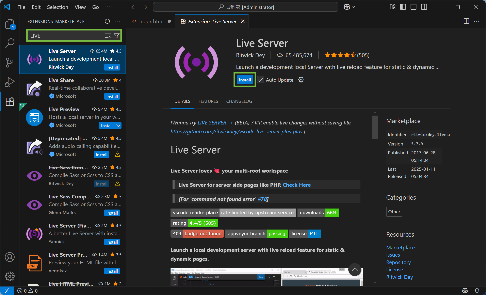
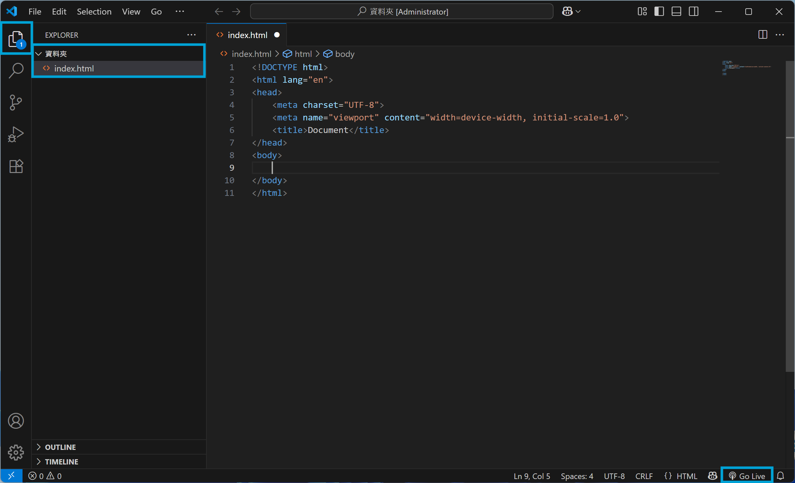

# HTML

毛哥 EM・資難而上 <!-- .element: style="font-size:1.5rem;margin:1em" -->

---

<div style="font-size:1.5rem;width:50%">

<!-- .slide: data-background-image="https://raw.githubusercontent.com/Edit-Mr/Edit-Mr/main/avatar.webp" data-background-opacity="1" data-background-size="30%" data-background-position="80% 50%" data-transition="zoom" -->

關於我 <!-- .element: style=font-size:1.2rem;margin:1em -->

## 毛哥 EM

_全端工程 | 英文辯論_ <!-- .element: style="font-size:1.2rem;margin:-.5rem 1rem 1rem" -->

-   ⻄苑高中高三 ⇀ 交大資工
-   中電會第三屆資訊組組長
-   SITCON 2024 / 2025 / Camp 2025 講師
-   九年網頁開發經驗
-   Awwwards 常態評審

</div>

---

## 第一個網站

_網站講白就是要用瀏覽器打開的 Word 檔_

但是只有純文字太無聊了，所以我們在文字間做一些標記讓他們有不一樣的意義

---

## HTML

超文本標記語言 HyperText Markup Language  
作為網站的骨架  
 <!-- .element: height="400px" -->

---

## Codepen

網頁的 Google Docs

網址：[pen.new](https://pen.new)

---

## 試試看

```html
<h1>這是標題</h1>
```

---

## 元素

網站所有東西都是由元素組成
 <!-- .element: style="filter:invert(1);" -->

---

## 標題

<div style="display:flex;align-items:center;">
<div style="flex:1;">

```html
<h1>H1</h1>
<h2>H2</h2>
<h3>H3</h3>
<h4>H4</h4>
<h5>H5</h5>
<h6>H6</h6>
```

</div>
<div style="flex:1;">

# H1

## H2

### H3

#### H4

##### H5

###### H6

</div>

</div>

---

## >< 好麻煩 /

---

## emmet

`h1` + `tab` 會變成 `<h1></h1>`

---

## 文字效果

<div style="display:flex;align-items:center;">
<div style="flex:1.5;">

```html
<p>
    段落
    <b>粗體</b>
    <i>斜體</i>
    <s>刪除線</s>
    <u>底線</u>
    H<sup>+</sup> CO<sub>2</sub>
</p>
```

</div>
<div style="flex:1;">

**粗體**  
_斜體_  
~~刪除線~~  
<u>底線</u>  
H<sup>+</sup> CO<sub>2</sub>

</div>
</div>

---

## 空白 換行

一個以上的 tab、空格、換行都視為一個空格
所以要換行要使用`<br>`標籤

---

## 無序清單

<div style="display:flex;align-items:center;">
<div style="flex:1.5;">

```html
<ul>
    <li>a</li>
    <li>b</li>
    <li>c</li>
</ul>
```

</div>
<div style="flex:1;">

-   a
-   b
-   c

</div>
</div>
---

## 有序清單

<div style="display:flex;align-items:center;">
<div style="flex:1.5;">

```html
<ol>
    <li>a</li>
    <li>b</li>
    <li>c</li>
</ol>
```

</div>
<div style="flex:1;">

1. a
2. b
3. c

</div>
</div>
---

## 清單清單

<div style="display:flex;align-items:center;">
<div style="flex:1.5;">

```html
<ul>
    <li>清單裡可以有清單</li>
    <li>
      <ul>
          <li>沒錯</li>
          <li>就是這樣</li>
      </ul>
    </li>
</ul>
```

</div>
<div style="flex:1;">

-   清單裡可以有清單
    -   沒錯
    -   就是這樣

</div>
</div>
---

## 超連結

```html
<a href="連結">顯示文字</a>
```

```html
<a href="https://www.google.com">Goolge</a>
```

[Google](https://www.google.com)


---

### 新分頁開啟

```html
<a href="連結" target="_blank">顯示文字</a>
```

<a href="https://www.google.com" target="_blank">Google</a>

---

## 圖片

```html

```

```html

```


---

## 表格

```html
<table>
    <tr>
        <!-- 橫列 -->
        <th>國家</th>
        <!-- 標題格 -->
        <th>首都</th>
        <th>人口</th>
        <th>語言</th>
    </tr>
    <tr>
        <td>USA</td>
        <!-- 一個單元格 -->
        <td>Washington D.C.</td>
        <td>309</td>
        <td>English</td>
    </tr>
    <tr>
        <td>Sweden</td>
        <td>Stockholm</td>
        <td>9</td>
        <td>Swedish</td>
    </tr>
</table>
```

---

| 國家 | 首都 | 人口 | 語言 |
|------|------|------|------|
| USA | Washington D.C. | 309 | English |
| Sweden | Stockholm | 9 | Swedish |

---

## 輸入框

<input type="text" />

```html
<input type="text" />
```

--

### 密碼輸入框

<input type="password" />

```html
<input type="password" />
```

--

### 勾選框

<input type="checkbox"> <span style=font-size:1.2rem>我已詳細閱讀使用者服務條款</span>

```html
<input type="checkbox" /> 我已詳細閱讀使用者服務條款
```

--

### 勾選框 (已勾選)

<input type="checkbox" checked> <span style=font-size:1.2rem>我已詳細閱讀使用者服務條款</span>

```html
<input type="checkbox" checked /> 我已詳細閱讀使用者服務條款
```

--

### disabled

<input type="checkbox" disabled> <span style=font-size:1.2rem>我已詳細閱讀使用者服務條款</span>

```html
<input type="checkbox" disabled /> 我已詳細閱讀使用者服務條款
```
--

### disabled

不同意的請舉手

<input type="checkbox" disabled checked> <span style=font-size:1.2rem>同意</span>

```html
<input type="checkbox" disabled checked /> 同意
```
--

### label

<input type="checkbox" id="terms" checked />
<label for="terms"  style=font-size:1.2rem>我已詳細閱讀使用者服務條款</label>

```html
<input type="checkbox" id="terms" checked />
<label for="terms">我已詳細閱讀使用者服務條款</label>
```

---

## 單選框

<input type="radio" name="color" value="red"> red<br>
<input type="radio" name="color" value="green"> green<br>
<input type="radio" name="color" value="blue"> blue

```html
<input type="radio" name="color" value="red" /> red<br />
<input type="radio" name="color" value="green" /> green<br />
<input type="radio" name="color" value="blue" /> blue
```

---

## 表單

```html
<form action="資料傳給哪個網址" method="傳輸方式">
    <!--post, get-->
    <input type="text" name="name" placeholder="輸入你的名字" />
    <input type="submit" value="送出" />
</form>
```

--

## Google 搜尋範例

```html
<form action="https://www.google.com/search" method="get">
    <input type="text" name="q" placeholder="搜尋 Google" />
    <input type="submit" value="搜尋" />
</form>
```

<form action="https://www.google.com/search" method="get">
    <input type="text" name="q" placeholder="搜尋 Google" />
    <input type="submit" value="搜尋" />
</form>

---

## IDE

整合式開發環境

---

## 視覺化工作室程式碼

 <!-- .element: height="400px" -->

--

### 開啟資料夾


--

### 安裝擴充功能




--

### 建立第一個網頁



---

# 基本架構

emmet: `!` + `tab`

```html
<!DOCTYPE html> <!-- HTML5 -->
<html lang="en"> <!-- 語言 -->
  <head> <!-- 不會直接顯示在網頁中 -->
      <meta charset="UTF-8" /> <!-- 編碼方式 -->
      <meta name="viewport" content="width=device-width, initial-scale=1.0" />
      <!-- 適應不同大小的螢幕 -->
      <title>Document</title> <!-- 網頁標題 -->
  </head>
  <body>
      <!-- 內容直接顯示在網頁中 -->
  </body>
</html>
```

---

## 絕對路徑與相對路徑

* **絕對路徑**：這個檔案在本機端或是網路上的絕對位置
* **相對路徑**：相對於這個檔案的位置
  * 上一層：`../`

```html

<!-- 目前的目錄下的檔案 -->

<!-- 上一層目錄下的圖片檔案 -->
```