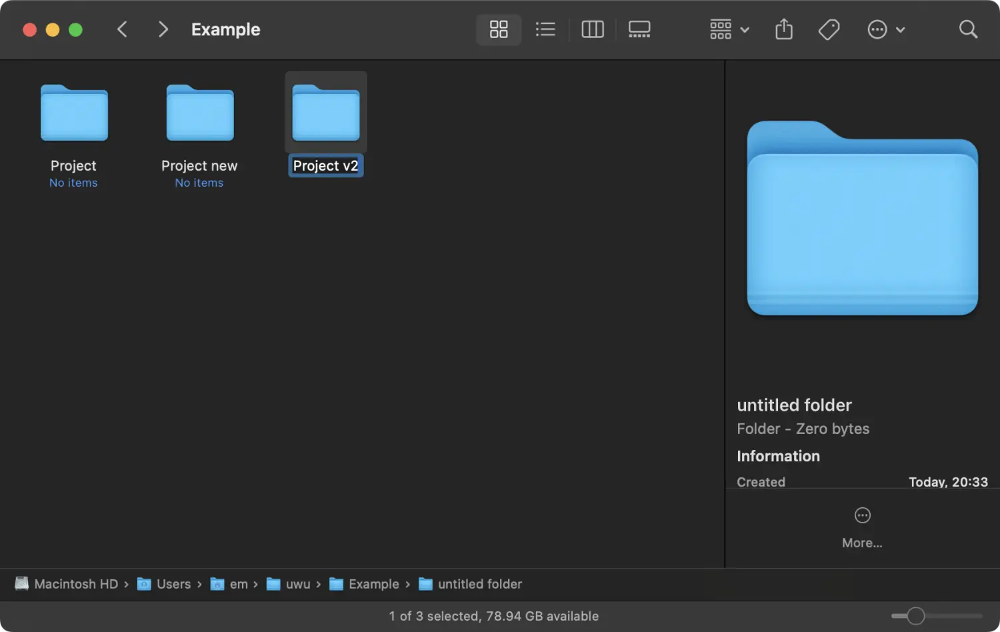
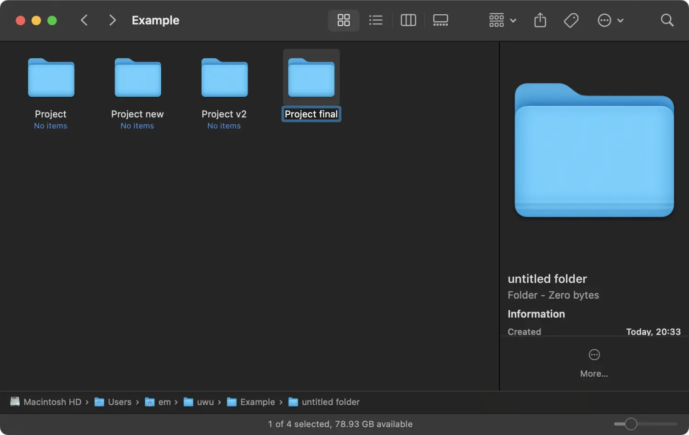

# Git & GitHub

毛哥 EM

<!-- .slide: data-transition="fade-out" -->

---

文章教學：

https://emtech.cc/p/github-and-git/
<!-- .slide: data-transition="fade" -->

---

<!-- .slide: data-transition="none fade-in" -->

你們用過 Git / GitHub 嗎？

---

<!-- .slide: data-transition="none" -->

「等等剛才寫錯了...可以改回來嗎？」

--

<!-- .slide: data-transition="none" -->

「額原本真的是這樣嗎？怎麼跑不起來了？」

--

## 版本控制

--


--

<!-- .slide: data-transition="none" -->



--

<!-- .slide: data-transition="none" -->



--

<!-- .slide: data-transition="none" -->


--


<!-- .slide: data-transition="none" -->

「可以把程式碼 email 給我嗎？」

--

<!-- .slide: data-transition="none" -->

「欸等等這垃圾是誰寫的？」

---

introducing
<!-- .slide: data-transition="zoom-in fade-out" -->

---

# Git

<!-- .slide: data-transition="zoom-in fade-out" -->

---

<!-- .slide: data-transition="fade" -->

## Git 可以幹嘛？

-   專案版本控制：記錄修改歷史
-   團隊協作：多人同時編輯、合併
-   回溯錯誤：回到之前正常的狀態
-   Open Source：與世界接軌

「哦，原來這個垃圾是我寫的。」<!-- .element: style="font-size:.5em;margin-top:3rem" -->

---

<!-- .slide: data-auto-animate -->

## Git 是什麼？

分散式版本控制系統（DVCS）。

<p class="fragment fade-up">蛤？</p>

--

<!-- .slide: data-auto-animate -->

## Git 是什麼？

分散式版本控制系統（DVCS）。

-   每個人電腦都有完整專案（倉庫）
-   每次提交（commit），都像是儲存一個快照（snapshot）
-   支援離線操作

---

## 版本控制類型

-   本地端版本控制（Local VCS）
-   集中式版本控制（CVCS）
-   分散式版本控制（DVCS）

---

## Git 的邏輯

我們來畫張圖，Git 就像是在寄包裹。

--

你也可以想像 Github 是物流中心，而 git 就是物流。我們透過物流來傳資料到 Github 的倉庫合獲取檔案。git 厲害的地方是每次上傳或下載時它會比較差異，只傳送不同的檔案。除了節省時間流量之外，因為記錄了每一次的更動，所以可以進行版本控制。包括釋出不同版本，和復原到指定版本。

--

- 如果要從網上下載下來檔案我們要 `clone`（複製）下來
- 如果 `clone` 之後有更新的版本想下載直接 `pull` 就會把新增的東西下載下來。

--

而要上傳檔案就像剛才說寄包裹一樣。

- 我們要先填寫寄信人（我們）的資訊，還有收件人的地址（網址）。這個只需要寫一次就可以了
- 接下來我們要 `add`（選擇）要傳送的資料。通常會選擇傳送所有你編輯過的地方。
- 選好之後我們到把包裹 `commit`（打包起來），並留下一串訊息（必填，簡單講你做了什麼編輯，之後比較好看）
- 最後把它 `push`（寄）出去就好囉

---

## 安裝 Git

https://git-scm.com/

> 安裝完後請先註冊 [GitHub 帳號](https://github.com)<br>
> 並用 VS Code 打開一個資料夾

---

## 初始設定

打開終端機並輸入

```bash
git config --global user.name "你的名字"
git config --global user.email "you@example.com"
```

---


我們來嘗試把今天做的網站部署到 GitHub 上！

---

## GitHub 是什麼？

☁️ 線上 Git 倉庫平台

工程師的 Facebook／雲端硬碟

-   團隊協作
-   Issue / Pull Request
-   Actions 自動化
-   網頁展示 (GitHub Pages)

---

## 克隆（Clone）專案

```bash
git clone https://github.com/someone/project.git
```

📂 簡單來說就是下載 repo 然後自動設定好遠端

---

## 加入檔案到版本控制

```bash
git add index.html     # 加入單一檔案
git add .                # 加入所有變更
```

---

接著提交：

```bash
git commit -m "第一次提交"
```

---

## 所以之後每次更新東西之後...

```bash
git add .
git commit -m "更新了 XXX 功能"
git push
```

💡 建議每個功能/步驟都提交一次

---

## 從遠端拉取下來

```bash
git pull
```

---

## 進階操作

--

## 查看狀態與歷史

```bash
git status
```

查看提交紀錄：

```bash
git log --oneline
```

--

## 建立新倉庫

```bash
git init
```

📁 建立 `.git/` 隱藏資料夾，開始版本控制

--

## Git 分支 (Branch)

```bash
git branch dev              # 建立 dev 分支
git checkout dev            # 切換到 dev
git switch dev              # 現代用法
```

✂️ 讓你同時開發多條功能線，不互相干擾

--

## 分支合併 (Merge)

```bash
git checkout main
git merge dev
```

🧠 如果有衝突（conflict）需要手動解決再 commit！

--

## 將本地倉庫推上 GitHub

1. 建立 GitHub repo
2. 將遠端加進來：

```bash
git remote add origin https://github.com/你/repo.git
```

3. 推上去：

```bash
git push -u origin main
```

--

其實這些操作也不進階，不過先熟練簡單的上傳下載喔！

---

## Pull Request

和網路上的朋友一起寫程式！

1. Fork 專案
2. 建立分支 + 編輯 + commit
3. Push 到你自己的 repo
4. 建立 Pull Request (PR)

---

## 常見指令複習

```bash
git clone <網址>
git add .
git commit -m "訊息"
git push
git pull
```

<!-- .slide: data-transition="fade-out" -->
---

<!-- .slide: data-transition="fade-in" -->

本投影片由 [毛哥EM](https://elvismao.com/) 製作  
採用創用 CC「[姓名標示 4.0 國際](https://creativecommons.org/licenses/by/4.0/deed.zh-hant)」授權


[毛哥EM資訊密技](https://emtech.cc/)・[毛哥EM公開簡報](https://g.elvismao.com/slides)